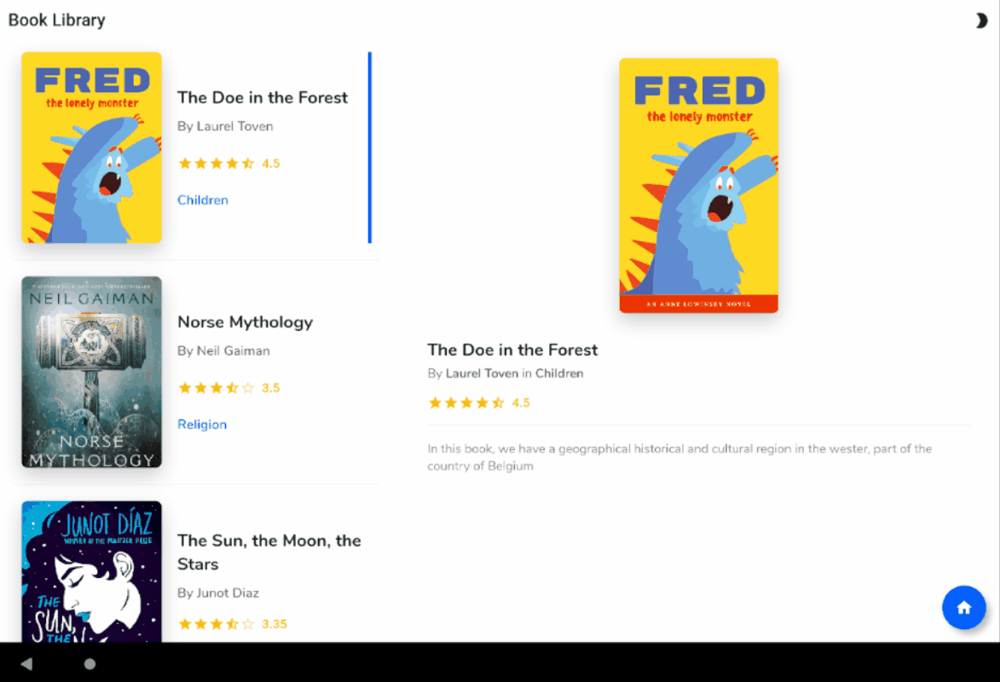

# Book Library

Book Library application where u can make simple CRUD operations (create, read, update, delete).
This application has a dark theme, the state is managed by the `ThemeNotifier` class and injected by the `Provider` package.
This simple application demonstrates the use of the `Provider` package in specific the `ChangeNotifierProvider`.
I make use of a simple model, together with a `Notifier` class which extends from `ChangeNotifier`.

## Showcase
### Phone
Light Theme        |  Dark Theme
:-------------------------:|:-------------------------:
  | 

### Tablet
This project contains adaptive widgets, to display both on a phone and a tablet.

her_icons](https://pub.dev/packages/flutter_launcher_icons)
